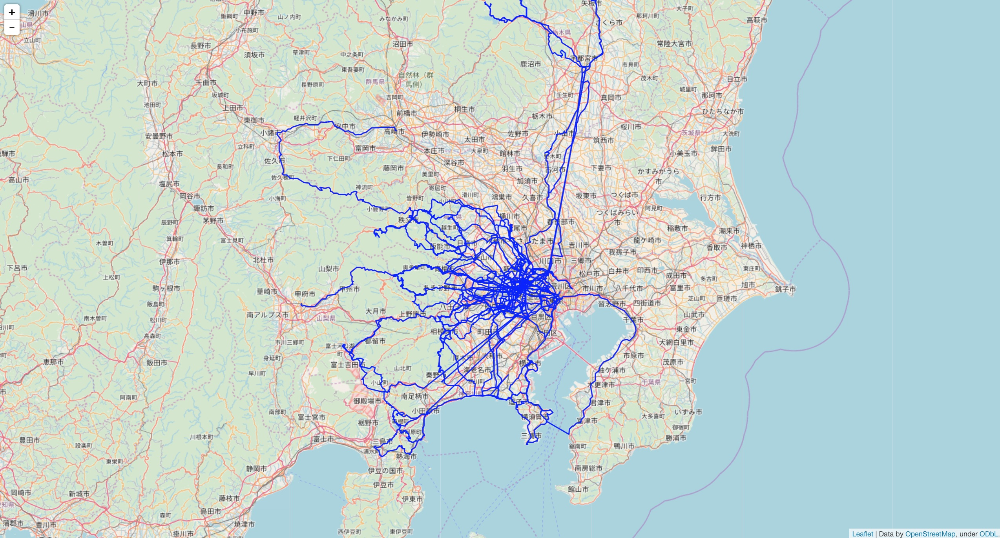
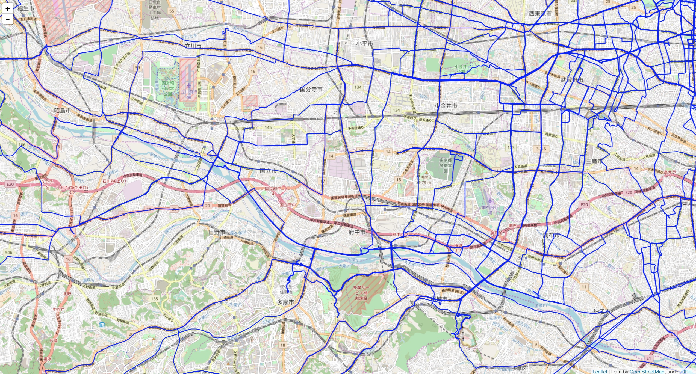
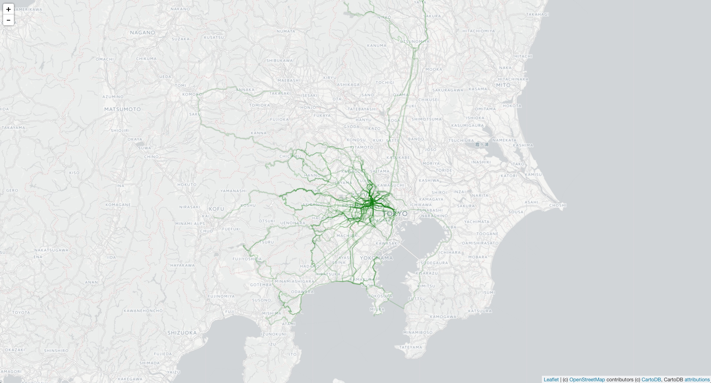
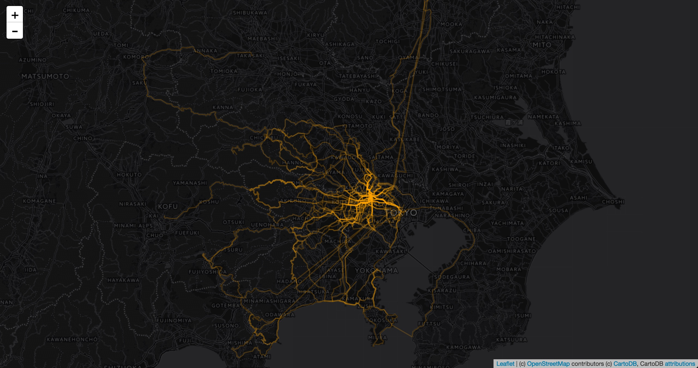
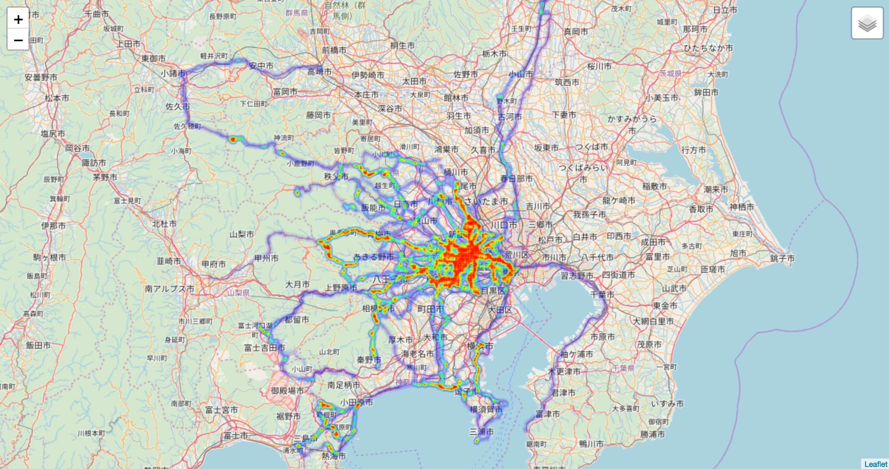
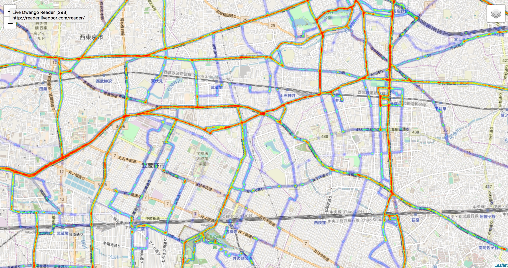
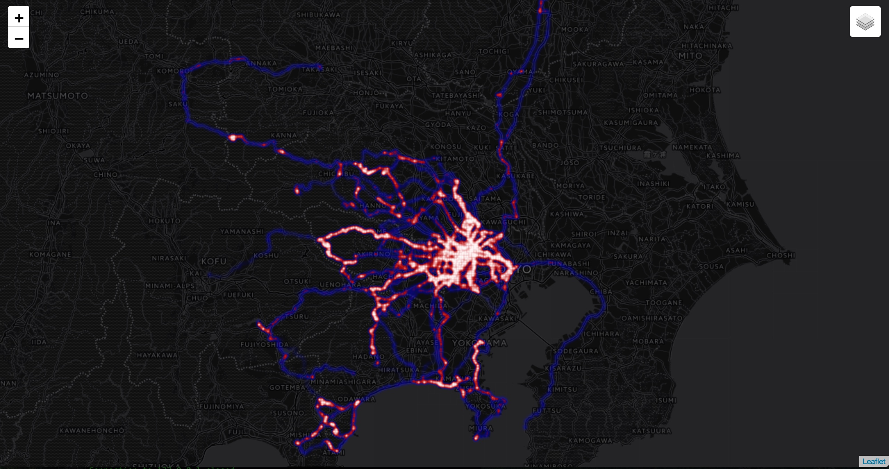
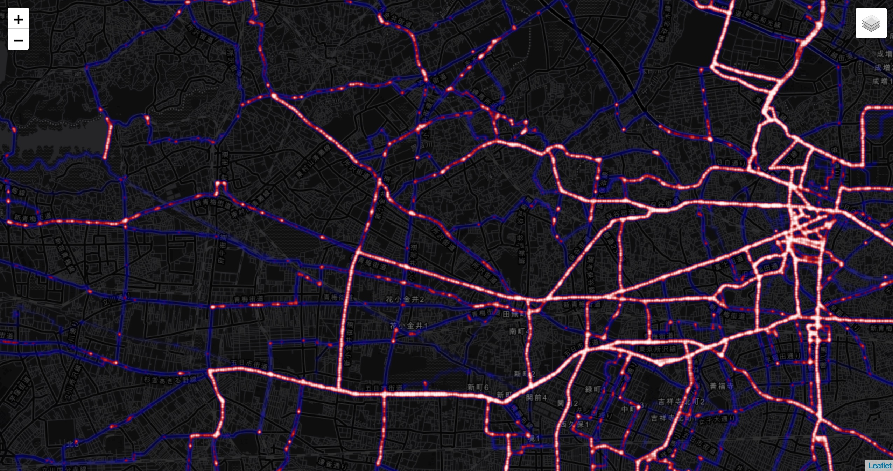
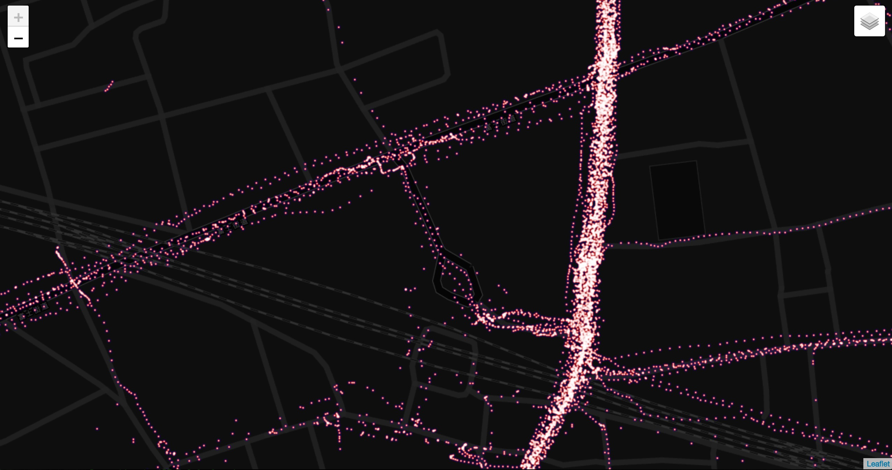

# GPX Overlay

make a GPX overlayerd map from multiple GPXs

## overlay.py





##### Change Style

```sh
bin/overlay.py -c green --line-alpha 0.2
```



```sh
bin/overlay.py -c red --line-alpha 0.2
```



#### Usage

```
Usage: overlay.py [options]

Options:
  -h, --help            show this help message and exit
  -d ACTIVITIES, --activities-dir=ACTIVITIES
                        path to directory contains GPX activities
  -c COLOR, --line-color=COLOR
                        specify PolyLine color
  -a ALPHA, --line-alpha=ALPHA
                        specify PolyLine opcacity
  -w WEIGHT, --line-weight=WEIGHT
                        specify PolyLine weight
  -z ZOOM, --zoom=ZOOM  specify map zoom level
  -o OUTPUT, --output=OUTPUT
                        path to HTML output
  -t TILES, --tile=TILES
                        tile server
  -l LOCATION, --location=LOCATION
                        central point (latitude, longitude) of the map
```

#### sample (1)

```
$ ls -1 data/activities/ | head
20160602-120512-Ride.gpx
20160611-024718-Ride.gpx
20160613-015834-Ride.gpx
20160613-131411-Ride.gpx
20160615-112622-Ride.gpx
20160618-094548-Ride.gpx
20160619-013905-Ride.gpx
20160619-070943-Ride.gpx
...

$ bin/overlay.py
$ open overlay.html
```

#### sample (2)

```
$ bin/overlay.py -t cartodbpositron -c green --line-alpha 0.2
$ open overlay.html
```

## heatmap.py

```sh
$ bin/heatmap.py
$ open heatmap.html
```





##### Change Style

```sh
$ bin/heatmap.py
$ open heatmap.html
```







#### Usage

```
Usage: heatmap.py [options]

Options:
  -h, --help            show this help message and exit
  -d ACTIVITIES, --activities-dir=ACTIVITIES
                        path to directory contains GPX activities
  -z ZOOM, --zoom=ZOOM  specify map zoom level
  -o OUTPUT, --output=OUTPUT
                        path to HTML output
  -t TILES, --tile=TILES
                        tile server
  -b BLUR, --blur=BLUR  specify heatmap blur
  -r RADIUS, --radius=RADIUS
                        specify heatmap radius
  -g GRADIENT, --gradient=GRADIENT
                        specify heatmap color gradient
  -l LOCATION, --location=LOCATION
                        central point (latitude, longitude) of the map
```

## Requirements

 * Python3
